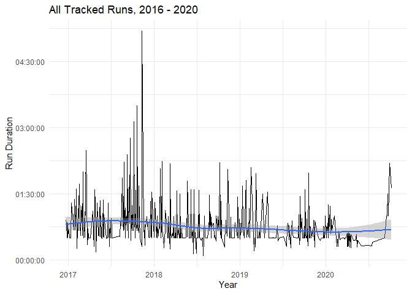
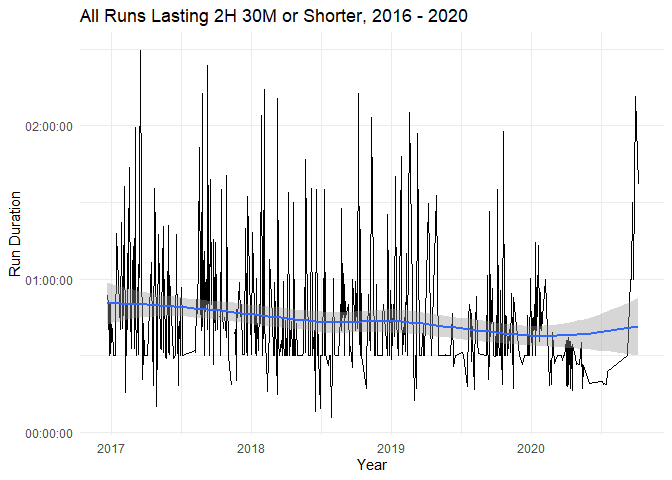
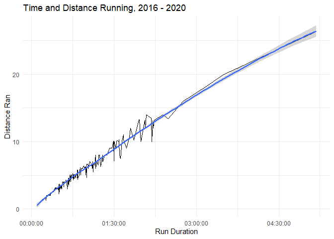

Exploratory Data Analysis of Hilary’s Running Data (12/2016-11/2020)
================
Hilary M. Dotson
11/27/2020

``` r
library(tidyverse)
library(magrittr)
library(lubridate)
```

# Purpose

The purpose of this RMD is to provide a short exploratory data analysis
of my own personal Garmin running data from December 2016 through
November 2020. It’s fun for me to be a little navel gaze-y and tell my
“running story” through some really basic exploratory data analyses.

# Data Preprocessing

In preparing these data, I completed several steps ahead of the
analysis:

1.  Load the locally saved Garmin data.
2.  Examine the data.
3.  Blanket change column names to tidy-convention.
4.  Remove the columns containing unnecessary data.
5.  Convert dates and time from factors and characters to appropriate
    date/time measurement.

<!-- end list -->

``` r
# Load locally saved Garmin data
garmin_data <- read.csv("dotson_running.csv")

# Examine data
str(garmin_data)
```

    ## 'data.frame':    455 obs. of  30 variables:
    ##  $ Activity.Type           : chr  "Running" "Running" "Running" "Running" ...
    ##  $ Date                    : chr  "2020-10-04 17:19:28" "2020-09-28 17:36:08" "2020-09-21 16:57:57" "2020-09-19 13:34:16" ...
    ##  $ Favorite                : chr  "false" "false" "false" "false" ...
    ##  $ Title                   : chr  "Washington - 7.5 mi, .5/.25 split" "Washington - 10 mi run/walk" "Washington - 60 min run/walk, 6/4" "Washington - 90 min run /walk" ...
    ##  $ Distance                : num  7.5 10 4.85 7.09 4.65 4.67 2.2 2.5 2.01 2 ...
    ##  $ Calories                : chr  "406" "730" "393" "595" ...
    ##  $ Time                    : chr  "01:36:55" "02:11:26" "01:00:00" "01:30:00" ...
    ##  $ Avg.HR                  : chr  "108" "135" "146" "151" ...
    ##  $ Max.HR                  : chr  "161" "179" "194" "192" ...
    ##  $ Aerobic.TE              : chr  "2.0" "2.8" "3.5" "3.2" ...
    ##  $ Avg.Run.Cadence         : chr  "146" "147" "150" "147" ...
    ##  $ Max.Run.Cadence         : chr  "243" "246" "244" "247" ...
    ##  $ Avg.Pace                : chr  "12:55" "13:09" "12:23" "12:42" ...
    ##  $ Best.Pace               : chr  "8:21" "7:54" "8:41" "7:58" ...
    ##  $ Elev.Gain               : chr  "565" "889" "367" "489" ...
    ##  $ Elev.Loss               : chr  "559" "867" "361" "427" ...
    ##  $ Avg.Stride.Length       : num  0.83 0.82 0.85 0.85 0.85 0.86 0.82 1.01 1.04 1.03 ...
    ##  $ Avg.Vertical.Ratio      : num  0 0 0 0 0 0 0 0 0 0 ...
    ##  $ Avg.Vertical.Oscillation: num  0 0 0 0 0 0 0 0 0 0 ...
    ##  $ Training.Stress.ScoreÂ. : num  0 0 0 0 0 0 0 0 0 0 ...
    ##  $ Grit                    : num  0 0 0 0 0 0 0 0 0 0 ...
    ##  $ Flow                    : num  0 0 0 0 0 0 0 0 0 0 ...
    ##  $ Climb.Time              : chr  "1:36:55" "2:11:26" "1:00:00" "1:30:00" ...
    ##  $ Bottom.Time             : chr  "0:00" "0:00" "0:00" "0:00" ...
    ##  $ Min.Temp                : num  0 0 0 0 0 0 0 0 0 0 ...
    ##  $ Surface.Interval        : chr  "0:00" "0:00" "0:00" "0:00" ...
    ##  $ Decompression           : chr  "No" "No" "No" "No" ...
    ##  $ Best.Lap.Time           : chr  "04:26.31" "02:31.18" "04:00.00" "05:00.00" ...
    ##  $ Number.of.Laps          : chr  "20" "27" "12" "18" ...
    ##  $ Max.Temp                : num  0 0 0 0 0 0 0 0 0 0 ...

``` r
# Change column names --
## Remove periods and replace with underscores. 
names(garmin_data) <- gsub("\\.", "_", names(garmin_data)) 

## Remove non-English character and underscore in 1 column
names(garmin_data) <- gsub("Â_", "", names(garmin_data))

## Convert all variable names to lowercase. 
garmin_data %<>% dplyr::rename_all(tolower)

# De-select unnecessary columns
garmin_data %<>%
  dplyr::select(-c(favorite, avg_vertical_ratio, avg_vertical_oscillation,
                   training_stress_score, grit, flow, bottom_time, min_temp,
                   surface_interval, decompression, max_temp, climb_time))

# Date/time conversions
## Convert date/time variables to date and time from YMD HMS character.
garmin_data$date <- lubridate::ymd_hms(garmin_data$date) 


## Convert "time" (duration of run) to HMS format time from HMS character
garmin_data$time <- lubridate::hms(garmin_data$time)
### Convert HMS format time to period measured in seconds 
garmin_data$time <- lubridate::seconds(garmin_data$time)


## Convert "avg_pace" to MS format time from MS character
garmin_data$avg_pace <- lubridate::ms(garmin_data$avg_pace)
### Convert MS format time to period measured in seconds 
garmin_data$avg_pace <- lubridate::seconds(garmin_data$avg_pace)
```

Now that the conversions are complete, let’s take a look at the cleaned
data.

``` r
# Re-examine data
str(garmin_data)
```

    ## 'data.frame':    455 obs. of  18 variables:
    ##  $ activity_type    : chr  "Running" "Running" "Running" "Running" ...
    ##  $ date             : POSIXct, format: "2020-10-04 17:19:28" "2020-09-28 17:36:08" ...
    ##  $ title            : chr  "Washington - 7.5 mi, .5/.25 split" "Washington - 10 mi run/walk" "Washington - 60 min run/walk, 6/4" "Washington - 90 min run /walk" ...
    ##  $ distance         : num  7.5 10 4.85 7.09 4.65 4.67 2.2 2.5 2.01 2 ...
    ##  $ calories         : chr  "406" "730" "393" "595" ...
    ##  $ time             :Formal class 'Period' [package "lubridate"] with 6 slots
    ##   .. ..@ .Data : num  5815 7886 3600 5400 3600 ...
    ##   .. ..@ year  : num  0 0 0 0 0 0 0 0 0 0 ...
    ##   .. ..@ month : num  0 0 0 0 0 0 0 0 0 0 ...
    ##   .. ..@ day   : num  0 0 0 0 0 0 0 0 0 0 ...
    ##   .. ..@ hour  : num  0 0 0 0 0 0 0 0 0 0 ...
    ##   .. ..@ minute: num  0 0 0 0 0 0 0 0 0 0 ...
    ##  $ avg_hr           : chr  "108" "135" "146" "151" ...
    ##  $ max_hr           : chr  "161" "179" "194" "192" ...
    ##  $ aerobic_te       : chr  "2.0" "2.8" "3.5" "3.2" ...
    ##  $ avg_run_cadence  : chr  "146" "147" "150" "147" ...
    ##  $ max_run_cadence  : chr  "243" "246" "244" "247" ...
    ##  $ avg_pace         :Formal class 'Period' [package "lubridate"] with 6 slots
    ##   .. ..@ .Data : num  775 789 743 762 774 771 819 575 560 579 ...
    ##   .. ..@ year  : num  0 0 0 0 0 0 0 0 0 0 ...
    ##   .. ..@ month : num  0 0 0 0 0 0 0 0 0 0 ...
    ##   .. ..@ day   : num  0 0 0 0 0 0 0 0 0 0 ...
    ##   .. ..@ hour  : num  0 0 0 0 0 0 0 0 0 0 ...
    ##   .. ..@ minute: num  0 0 0 0 0 0 0 0 0 0 ...
    ##  $ best_pace        : chr  "8:21" "7:54" "8:41" "7:58" ...
    ##  $ elev_gain        : chr  "565" "889" "367" "489" ...
    ##  $ elev_loss        : chr  "559" "867" "361" "427" ...
    ##  $ avg_stride_length: num  0.83 0.82 0.85 0.85 0.85 0.86 0.82 1.01 1.04 1.03 ...
    ##  $ best_lap_time    : chr  "04:26.31" "02:31.18" "04:00.00" "05:00.00" ...
    ##  $ number_of_laps   : chr  "20" "27" "12" "18" ...

# Quick Summary Statistics

Now, let’s take a look at some key running statistics. In particular,
for the 455 runs I did, let’s take a look at how long I was out there,
my average pace, and my distance.

``` r
# Calculate summary statistics
time_running <- summary(garmin_data$time)
pace_running <- summary(garmin_data$avg_pace)
distance_running <- summary(garmin_data$distance)

# Column bind to present together
td_running <- cbind(time_running, distance_running, pace_running)

td_running
```

    ##         time_running            distance_running   pace_running          
    ## Min.    "5M 58.8S"              "0.61"             "8M 7S"               
    ## 1st Qu. "30M 3S"                "3.27"             "8M 55.5S"            
    ## Median  "35M 8S"                "3.71"             "9M 15S"              
    ## Mean    "45M 21.5652747252748S" "4.73652747252747" "9M 25.9912087912088S"
    ## 3rd Qu. "50M 6.5S"              "5.115"            "9M 38S"              
    ## Max.    "5H 10M 59S"            "26.32"            "13M 39S"

Based on the first quartile and median, we can tell that about half of
my runs were approximately 30 minutes long and in the 3.25-3.5 mile
range. Now, let’s take a look at how long I spent running.

# Time Spent Running Over Time

Now, a quick visual inspection of the full run data.frame, examining how
much time each of my runs took over time.

``` r
garmin_data %>%
  ggplot2::ggplot(aes(date, time)) +
  ggplot2::geom_line() +
  ggplot2::geom_smooth() +
  ggplot2::scale_y_time() +
  ggplot2::labs(title = "All Tracked Runs, 2016 - 2020",
       x = "Year", 
       y = "Run Duration") +
  ggplot2::theme_minimal()
```

<!-- -->

You’ll notice that nearly all of my runs are under two hours—not at all
surprising given the summary statistics shown above. But what happened
in 2017? Why the spike? Well, when I first started running regularly in
2016, I had a goal to do a 10k by my birthday. Then, a half marathon
less than six months later. And finally, I wanted to do a marathon
around my 30th birthday. Technically, I did it a week after (in
Richmond). So you will notice that my “long runs” became considerably
longer in the latter half of 2017.

After one marathon though, I was *DONE*. I had a very hard time with the
marathon, even though my training was mostly successful. It took me far
longer than anticipated, and for the first and only time in my life, I
started having muscle spasms while running—during mile 18, so 8 more
miles with that. In short, I have no interest in doing a marathon again.
Honestly, I like the 10 mile distance the best, but anything from a 5k
to a half marathon I’m down for.

So, let’s re-scale the graphic to exclude runs that took longer than
2:30. Why 2:30? Well, my first half marathon was just shy of that, and I
gradually became faster over time (as we saw earlier–minus a few
injuries, which I’ll examine in more detail in future RMDs).

To do this, I’m actually going to create a new column that sets the
original “time” column to NA if the time value is greater than 2:30 (or,
9,000 seconds).

``` r
# Convert the lubridate formatted time variable to a numeric variable measured in seconds.
garmin_data$time_numeric <- lubridate::time_length(garmin_data$time, unit = "seconds")

garmin_data %<>%
  dplyr::mutate(short_time = case_when(
    time_numeric > 9000 ~ NA_real_,
    TRUE ~ time_numeric
  )) 

# Convert the numeric short_time variable to period format
garmin_data$short_time <- lubridate::as.period(garmin_data$short_time)
```

Next, for good measure, let’s take a quick look at the summary
statistics for the 451 runs I completed which were less than 2H 30M in
duration.

``` r
garmin_data %>%
  ggplot2::ggplot(aes(date, short_time)) +
  ggplot2::geom_line() +
  ggplot2::geom_smooth() +
  ggplot2::scale_y_time() +
  ggplot2::labs(title = "All Runs Lasting 2H 30M or Shorter, 2016 - 2020",
       x = "Year", 
       y = "Run Duration") +
  ggplot2::theme_minimal()
```

<!-- -->

You get a much clearer picture of what my “typical” runs actually look
like in terms of the amount of time I spent out there running. But has
my pace improved at all in this time?

# Pace Over Time

I have a feeling that from when I started running to the present my pace
has more or less improved. I have had a few injuries in the last few
years, but on the whole, am I any faster than I used to be?

First, let’s take a look at some descriptive statistics, parsed by year.
To do this, I’m going to create five separate data.frames—one for each
of the calendar years I spent time running.

``` r
garmin_2016 <- garmin_data %>%
  dplyr::filter(date >= "2016-01-01 00:00:00" & date <= "2016-12-31 23:59:59")  

garmin_2017 <- garmin_data %>%
  dplyr::filter(date >= "2017-01-01 00:00:00" & date <= "2017-12-31 23:59:59")  

garmin_2018 <- garmin_data %>%
  dplyr::filter(date >= "2018-01-01 00:00:00" & date <= "2018-12-31 23:59:59")  

garmin_2019 <- garmin_data %>%
  dplyr::filter(date >= "2019-01-01 00:00:00" & date <= "2019-12-31 23:59:59")  

garmin_2020 <- garmin_data %>%
  dplyr::filter(date >= "2020-01-01 00:00:00" & date <= "2020-12-31 23:59:59")  
```

From here, I just want to see how many runs I completed in each year.

``` r
nrow_2016 <- nrow(garmin_2016)
nrow_2017 <- nrow(garmin_2017)
nrow_2018 <- nrow(garmin_2018)
nrow_2019 <- nrow(garmin_2019)
nrow_2020 <- nrow(garmin_2020)
nrow_all <- cbind(nrow_2016, nrow_2017, nrow_2018, nrow_2019, nrow_2020)

nrow_all
```

    ##      nrow_2016 nrow_2017 nrow_2018 nrow_2019 nrow_2020
    ## [1,]         6       138       141       103        67

I only completed 455 runs in 2016—that’s actually not true, but it’s all
I have tracked. I didn’t own a Garmin until December 2016, so very few
of my runs were actually tracked. That said, most of 2016 I was just
completing the Couch to 5K program so a lot more “run/walking” than
actually running. By the time December hit, I had already completed both
a 5K and 10K race—so I was consistently “running.”

From here, let’s check out my pace over time.

``` r
pace_2016 <- summary(garmin_2016$avg_pace)
pace_2017 <- summary(garmin_2017$avg_pace)
pace_2018 <- summary(garmin_2018$avg_pace)
pace_2019 <- summary(garmin_2019$avg_pace)
pace_2020 <- summary(garmin_2020$avg_pace)

pace_sum <- cbind(pace_2016, pace_2017, pace_2018, pace_2019, pace_2020)

pace_sum
```

    ##         pace_2016               pace_2017              pace_2018             
    ## Min.    "9M 15S"                "8M 24S"               "8M 7S"               
    ## 1st Qu. "9M 55S"                "9M 22.25S"            "8M 57S"              
    ## Median  "10M 7S"                "9M 41S"               "9M 14S"              
    ## Mean    "10M 16.1666666666666S" "9M 55.9420289855072S" "9M 17.5460992907801S"
    ## 3rd Qu. "10M 35.5S"             "10M 20S"              "9M 31S"              
    ## Max.    "11M 32S"               "12M 53S"              "11M 48S"             
    ##         pace_2019              pace_2020             
    ## Min.    "8M 7S"                "8M 13S"              
    ## 1st Qu. "8M 39S"               "8M 49S"              
    ## Median  "8M 56S"               "9M 2S"               
    ## Mean    "8M 53.7864077669902S" "9M 27.0895522388059S"
    ## 3rd Qu. "9M 7S"                "9M 20S"              
    ## Max.    "9M 36S"               "13M 39S"

Pretty clear strides made\! Now let’s check it on a time series graph,
using the full garmin\_data data.frame.

``` r
garmin_data %>%
  ggplot2::ggplot(aes(date, avg_pace)) +
  ggplot2::geom_line() +
  ggplot2::geom_smooth() +
  ggplot2::scale_y_time() +
  ggplot2::labs(title = "Average Pace, 2016 - 2020",
       x = "Year", 
       y = "Average Pace") +
  ggplot2::theme_minimal()
```

<!-- -->

Okay, cool\! Pretty clearly became faster over time… until late 2020.
What happened? The short answer is I had multiple injuries in late 2019
and mid 2020, so I ran a lot less *AND* I started run-walking again to
try to run while dealing with a significant shoulder injury. The massive
spike at the end of 2020 is the result of some 6-10 mile run/walks,
where I ran about half the time and walked the other half. I wanted to
keep running, but was afraid I would over-do it while wearing a sling.
Probably shouldn’t have been out at all, but what can I say?

Now, let’s take a look at time against distance\!

# Time and Distance Running

As I did with the tables earlier, let’s take a look at the distance
against the time I spent running. First, let’s examine the correlation.
For this, we’ll use the time\_numeric variable from the garmin\_data
data.frame, which represents the time, in seconds, I spent running
during each run. The Pearson’s R is 0.99—indicating a very strong and
positive relationship between the time I spent running and the distance
I ran. That’s a relief\! That said, from the previous analyses, we know
there were some blips…

Now, just for fun, let’s plot time and distance against one another.

``` r
garmin_data %>%
  ggplot2::ggplot(aes(time, distance)) +
  ggplot2::geom_line() +
  ggplot2::geom_smooth() +
  ggplot2::scale_x_time() +
  ggplot2::labs(title = "Time and Distance Running, 2016 - 2020",
       x = "Run Duration", 
       y = "Distance Ran") +
  ggplot2::theme_minimal()
```

<!-- -->

Shocking – the longer runs took more time\!

# Conclusion

In short, I’ve ran quite a bit in the last four years. I’m looking
forward to running again once I’m cleared to do so. I know I’ll have to
start out slow, but hoping to get close to where I was at late 2019.
